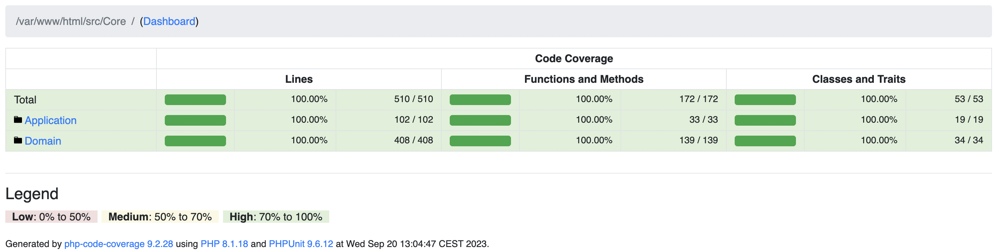
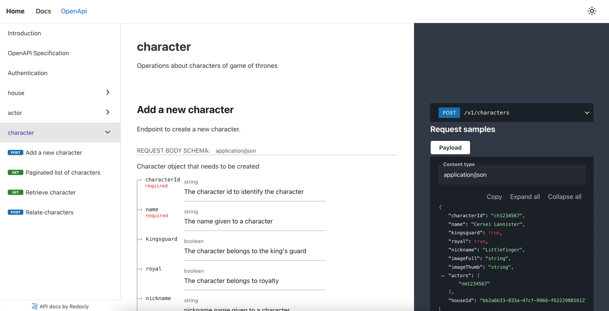

# Whalar - Backend Recruitment Test

## Sumary

The purpose of this test is to implement a RESTful API to manage the list of the characters present on Game of Thrones, paying special attention to the use of best practices, following SOLID and Clean Code principles.

## How has it been resolved?

To solve this recruitment test, a service has been created that is made up of the following containers:
- whalar-fvalverde-http-server
- whalar-fvalverde-app
- whalar-fvalverde-db
- whalar-fvalverde-adminer
- whalar-fvalverde-rabbitmq
- whalar-fvalverde-logstash
- whalar-fvalverde-elasticsearch
- whalar-fvalverde-kibana

This is a service that is accessed through a web server using nginx, exposing port 8080 to make requests.
These requests are handled by a PHP 8.1 application based on the symfony framework 6.3.

The data is persisted in a Postgre database and a container has been created to be able to view it comfortably using port "8001"

It has been developed following clean architecture patterns, avoiding coupling to the framework and separating by layers, respecting the solid principles, lean philosophy and the kiss principle.

Every action that causes a change in the system generates an event that is sent to a RabbitMq exchange.

The first difficulty I encountered was given a dataset with different data returned, generating a valid data model and its respective business rules, for this I took help from DDD (Domain Driven Design).
Through acceptance tests, validate the model and solve problems not detected during the development stage.

## Tools used in the project
### setup:
- makefile: Makefile is a way of automating software building procedure and other complex tasks with dependencies
- docker: Compose is a tool for defining and running multi-container Docker applications. With Compose, you use a YAML file to configure your application's services.

### ci/cd:
- git hooks: Git hooks are scripts that run automatically every time a particular event occurs in a Git repository and avoid generating commits or uploading code to the repository if it does not meet the acceptance criteria. Specifically pre-push
- gitlab ci/cd: A pipeline has been created with different stages to compile and validate the project.

### test:
- unit test with coverage
- mutant test
- acceptance test
- integration test

### linters:
- phpstan: Static analysis tool that allows you to find bugs in your codebase without running the code.
- PHP code sniffer: Tool that validates your code against a set of predefined standards

### doc
- openapi
- docusaurus
- redoc

### events:
- Stored event in database
- Send to rabbitmq
- ELK stack (ElasticSearch, Logstash, Kibana)

## Useful commands

### Build project

Setting up the project is quite simple thanks to make. Use the following command to build all the images:
```
make initialize
```

### Commands related to testing

```
make unit-test
```
```
make acceptance-test
```
```
make mutant-test
```

The code coverage reports are located in the folder report.

Below is an image of the html report:


### Documentation

In order to build and download all the dependencies it is necessary to have 'yarn' installed. To build the documentation exposing port "3000".

```
make start-doc
```
In this documentation you can see the API specifications in the Open API section

this is what it would look like:


### More commands
```
make help
```


